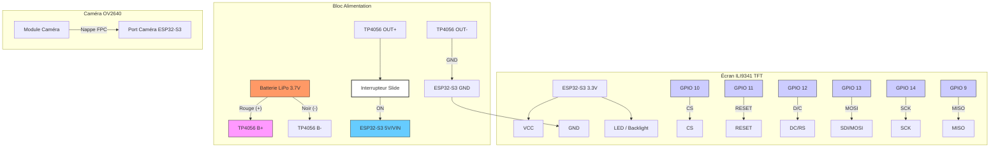

# 👁️ Cult of the Lamb : Eye Crown Project

**Regard de prédateur intelligent à suivi de mouvement**

Ce projet transforme un **ESP32-S3** et un **écran TFT** en un œil de monstre inspiré de l'univers de *Cult of the Lamb*. 

## 🛠️ LISTE DES COMPOSANTS

| Composant | Rôle | Spécification |
| --- | --- | --- |
| **ESP32-S3 Freenove** | Cerveau & IA | Version avec port caméra FPC. |
| **Caméra OV2640** | Vision | Objectif **160° Grand Angle** (Fisheye). |
| **Écran TFT 2.8" SPI** | Le Regard | 320x240, contrôleur **ILI9341**. |
| **Batterie LiPo 3.7V** | Énergie | EEMB 2000mAh 103454. |
| **Module TP4056** | Charge & Sécurité | Protection de décharge incluse. |
| **Interrupteur Slide** | Contrôle | Marche/Arrêt physique. |

## 🔌 SCHÉMA D'ALIMENTATION SÉCURISÉ

1. **Batterie** [B+/B-] -> **TP4056** [B+/B-]
2. **TP4056 [OUT-]** -> **ESP32-S3 [GND]**
3. **TP4056 [OUT+]** -> **Interrupteur [Patte milieu]**
4. **Interrupteur [Patte latérale]** -> **ESP32-S3 [5V/VIN]**



## 🧠 LOGIQUE D'ANIMATION

1. **Suivi (Tracking) :** Mapping des coordonnées de la caméra vers l'écran.
2. **Pupille Slit :** Forme ovale verticale noire (type reptile/démon).
3. **États de conscience :** - *Repos :* Balayage lent de gauche à droite.
   - *Concentration :* La pupille se rétrécit et fixe la cible détectée.

### 💻 CODE ESP32 (Arduino IDE)

#### Test écran TFT ILI9341 avec ESP32-S3 CAM

Ce test permet de vérifier le fonctionnement de l’écran **ILI9341 TFT LCD Controller** connecté à une **Freenove ESP32-S3 CAM Board** en utilisant l’interface SPI.

Le test affiche du texte et des couleurs sur l’écran.

#### Librairies nécessaires

Installer ces bibliothèques dans **Arduino IDE** :

- Adafruit GFX
- Adafruit ILI9341

## 3. SPI

Incluse automatiquement avec le core ESP32.

## Branchement

| TFT ILI9341 | ESP32-S3 |
| ----------- | -------- |
| VCC         | 3.3V     |
| GND         | GND      |
| CS          | GPIO10   |
| RESET       | GPIO11   |
| DC          | GPIO12   |
| MOSI        | GPIO13   |
| SCK         | GPIO14   |
| MISO        | GPIO9    |
| LED         | 3.3V     |

Pins du **tactile non utilisées**.

#### Code exemple

```cpp
#include <SPI.h>
#include <Adafruit_GFX.h>
#include <Adafruit_ILI9341.h>

#define TFT_CS   10
#define TFT_RST  11
#define TFT_DC   12
#define TFT_MOSI 13
#define TFT_CLK  14
#define TFT_MISO 9

Adafruit_ILI9341 tft = Adafruit_ILI9341(TFT_CS, TFT_DC, TFT_RST);

void setup() {

  SPI.begin(TFT_CLK, TFT_MISO, TFT_MOSI);

  tft.begin();
  tft.setRotation(1);

  tft.fillScreen(ILI9341_BLACK);

  tft.setTextColor(ILI9341_GREEN);
  tft.setTextSize(2);
  tft.setCursor(20,20);
  tft.println("ESP32-S3 OK");

  delay(2000);

  tft.fillScreen(ILI9341_RED);
  delay(1000);

  tft.fillScreen(ILI9341_GREEN);
  delay(1000);

  tft.fillScreen(ILI9341_BLUE);
}

void loop() {

}
```

#### Résultat attendu

Si tout fonctionne :

1. L’écran devient **noir**
2. Le texte **ESP32-S3 OK** apparaît
3. L’écran change de couleur :

   * rouge
   * vert
   * bleu

#### Dépannage

Si l’écran reste noir :

* vérifier **CS / DC inversés**
* vérifier **MOSI / MISO**
* vérifier alimentation **3.3V**
* vérifier installation des librairies

#### Animation

Setup with tft_espi & source code are private. **DO IT YOURSELF**